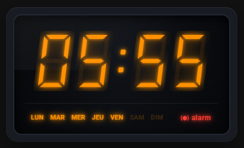

# Retro Alarm Card for Home Assistant

An elegant, minimalist Lovelace card that faithfully recreates the retro look of an 80s/90s digital clock radio with an amber 7-segment LED/VFD display.

---

## Preview


*(Screenshots coming soon)*

---

## How It Works & Core Concept

The **Retro Alarm Card** offers a classic digital clock radio interface while leveraging native Home Assistant components:

- **Time Setting:** Uses an `input_datetime` entity to set and display your alarm time.
- **Day Selection:** Uses boolean entities/switches to toggle active alarm days (Monday through Sunday).
- **Flexible Automation:** When the alarm triggers, it executes a standard Home Assistant **Automation**. This leaves total freedom on what happens when you wake up (play music, fade in lights, turn on the coffee maker, trigger TTS announcements, etc.).

---

## Credits & Acknowledgments

- **Community Inspiration:** The underlying concept of combining `input_datetime` with boolean switches for alarm scheduling stems from various ideas and discussions across the [Home Assistant Community Forums](https://community.home-assistant.io/).
- **AI-Assisted Development:** The custom Lovelace JavaScript implementation, CSS styling, and retro LED 7-segment design were developed with the assistance of Google's Gemini AI. 
- **Project Direction:** Designed, directed, tested, and maintained by Éric Senterre.

---

## What's New in v1.0.6

1. **Uppercase Days of the Week**:
   - `MON  TUE  WED  THU  FRI  SAT  SUN` (and equivalents across 10 languages) for an authentic retro LED/VFD display style.
   - Optimized spacing to ensure no day name gets clipped.

2. **Natural Slant (`slant`)**:
   - Inverted slant direction: positive values (e.g., `slant: 5`) now tilt numbers to the **right** (standard natural italic style).
   - `0` remains the default for vertical digits.

3. **Multilingual Support (10 Official HA Languages)**:
   - 🇬🇧 EN, 🇩🇪 DE, 🇫🇷 FR, 🇳🇱 NL, 🇪🇸 ES, 🇮🇹 IT, 🇵🇱 PL, 🇵🇹 PT, 🇷🇺 RU, 🇸🇪 SV.
   - Bundled directly inside the JS file (zero network requests, works fully offline).

4. **HACS & GitHub Ready**:
   - Includes a fully compliant `hacs.json` file.
   - Includes an open-source `LICENSE` file (MIT).

---

## Installation

### Method 1: Via HACS (Recommended)

1. Open **HACS** in your Home Assistant instance.
2. Click on the three dots in the top-right corner and select **Custom repositories**.
3. Add the repository URL:
   `https://github.com/esenterre/retro-alarm-card`
4. Set the category to **Dashboard** (or **Lovelace**) and click **Add**.
5. Search for **Retro Alarm Card** in HACS and click **Download**.
6. Restart Home Assistant or refresh your dashboard resources if prompted.

---

### Method 2: Manual Installation

1. Download the `retro-alarm-card.js` file from the [latest release](https://github.com/esenterre/retro-alarm-card/releases) or directly from this repository.
2. Copy `retro-alarm-card.js` into your Home Assistant `/config/www/` folder.
3. Go to **Settings** > **Dashboards** > **Three dots menu (top right)** > **Resources**.
4. Click **Add Resource** and configure:
   - **Url**: `/local/retro-alarm-card.js?v=1.0.6`
   - **Resource Type**: `JavaScript Module`
5. Save and refresh your browser (F5 or clear cache).

---

## Example YAML Configuration

```yaml
type: custom:retro-alarm-card
entity_time: input_datetime.reveil_matin_heure
entity_alarm: automation.chambre_reveil_matin
alarm_label: alarm
color: '#ff9100'
time_format: '24h'
minute_step: 1
```

*(Note: If `days` is omitted, the card automatically falls back to all 7 days in your Home Assistant profile language).*

## Configuration Options

| Option | Type | Default | Description |
| --- | --- | --- | --- |
| `entity_time` | string | `input_datetime.reveil_matin_heure` | Entity storing the alarm time |
| `entity_alarm` | string | `automation.chambre_reveil_matin` | Alarm entity or automation switch |
| `alarm_label` | string | `alarm` | Text displayed next to the sound icon |
| `color` | string | `#ff9100` | Digit color (amber `#ff9100`, green `#00ff66`, red `#ff3333`, etc.) |
| `time_format` | string | `24h` | Display format (`24h` or `12h`) |
| `minute_step` | number | `1` | Minute adjustment step per click (e.g., `1`, `5`) |
| `slant` | number | `0` | Slant angle in degrees (`0` for straight, `5` for right tilt) |
| `title` | string | `""` | Optional card title |
| `days` | list | 7 days | Optional custom list of day abbreviations |

